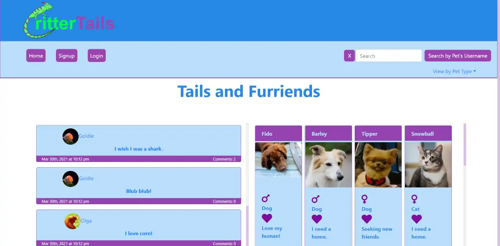

# CritterTails

## Description 

CritterTails is a social media app for pet lovers to create accounts for their pets so their "pets" can share their musings with the world.

---

## Table of Contents 

- [Website](#website)
- [Built With](#built-with)
- [Installation](#installation)
- [Usage](#usage)
- [License](#license)
- [Contributors](#contributors)
- [Acknowledgements](#acknowledgements)

---

## Website

https://crittertails.herokuapp.com/

---

## Built With

[Back to Contents](#table-of-contents)

---

## Installation

To install the PWA, click the install icon in the right side of  the address bar on desktop, or use your mobile device's installation method. For example, on Chrome for Android, open the menu in the top right of the page and click "Add to Home" or "Install".

[Back to Contents](#table-of-contents)

---

## Usage

To use CritterTails, sign your pet up first. Then you can change your pet's default image on their profile page. Then use the form on your pet's profile page to add your pet's latest "Tail". Click on a tail on a user's profile page or the home page, and you can comment as well. Use the search bar to filter the latest Tails by pet name. Use the dropdown menu on the home page to filter the list of pet users by pet type (dog, cat, etc...).

[Back to Contents](#table-of-contents)

---

## License

This project is covered under the MIT License.

[Back to Contents](#table-of-contents)
  
---

## Contributors

---
---
    
### Craig Bennett
    
- React (all pages and components, hooks)
- React-Bootstrap
- React Router
- IndexedDb
- PWA
- Redux (all state)
- Front End Apollo GraphQL Queries and Mutations
- Image uploading
- Deployment (Heroku)

[Craig5117](https://github.com/Craig5117)

---
---
    
### Adam Crandall

- Apollo GraphQL/Mongoose (resolvers, typeDefs)   
- React (SingleTail page, CommentList, CommentForm, NoMatch)
- Database seeds
- App Logo
- icons

[fancibleunicorn](https://github.com/fancibleunicorn)

---
---
    
### Dylan Tipton

- Apollo GraphQL/Mongoose (models, typeDefs)
- React (TailForm, CommentForm)
    
[tiptondt1998](https://github.com/tiptondt1998)

---
---
    
## Jessica Jensen

- CSS/Bootstrap CSS (PetProfile, Home, PetCard, TailList, Header, Nav)

[jrjensen14](https://github.com/jrjensen14)

---
---
    
## Bruce Anthony II

- CSS/Bootstrap CSS (Home, Login, Signup)
    
[bruceanthonyii](https://github.com/bruceanthonyii)

---
---

[Back to Contents](#table-of-contents)

---

## Acknowledgements

* [jsonwebtoken](https://www.npmjs.com/package/jsonwebtoken)
* [apollo-server-express](https://www.npmjs.com/package/apollo-server-express)
* [mongoose](https://mongoosejs.com/)
* [Express](https://expressjs.com/)
* [Cloudinary](https://cloudinary.com/homepage-2)
* [React-Bootstrap](https://react-bootstrap.github.io/)
* [Tech badges by Ileriayo](https://github.com/Ileriayo/markdown-badges)

[Back to Contents](#table-of-contents)